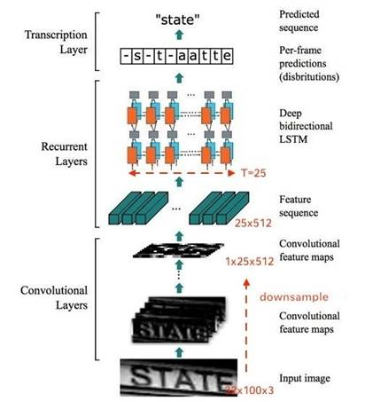
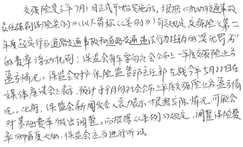

# 手写汉字识别

本实验主要基于MindSpore的实现手写汉字识别，主要包括手写汉字检测和手写汉字识别，能较准确的对标准字体的手写文字进行识别。

## 实验方案

在自然场景下进行手写汉字识别主要分为两个步骤：手写汉字检测和手写汉字识别。如下图所示，其中，手写汉字检测主要目标是从自然场景的输入图像中寻找到手写汉字区域，并将手写汉字区域从原始图像中分离出来；手写汉字识别的主要目标是从分离出来的图像中准确地识别出该手写汉字的含义。


### 汉字检测

对于手写汉字检测，考虑采用CTPN算法，CTPN是在ECCV 2016中论文 [Detecting Text in Natural Image with Connectionist Text Proposal Network](https://arxiv.org/abs/1609.03605) 中提出的一种文字检测算法。CTPN是在Faster RCNN的基础上结合CNN与LSTM深度网络，能有效的检测出复杂场景的横向分布的文字。

CTPN算法只能检测出横向排列的文字，其结构与Faster R-CNN基本类似，但是加入了LSTM层，网络结构如下图所示。


> 图片来源：[Detecting Text in Natural Image with Connectionist Text Proposal Network](https://arxiv.org/abs/1609.03605)

### 汉字识别

对于手写汉字识别考虑使用CNN+RNN+CTC（CRNN+CTC）方法进行识别。CNN用于提取图像特征，RNN使用的是双向的LSTM网络（BiLSTM），用于在卷积特征的基础上继续提取文字序列特征。使用CTCLoss可以解决输出和label长度不一致的问题，而不用手动去严格对齐。

整个CRNN网络分为三个部分，网络结构如下图所示。

 



> 图片来源：CRNN文本识别论文[An End-to-End Trainable Neural Network for Image-based Sequence
> Recognition and Its Application to Scene Text Recognition](https://arxiv.org/pdf/1507.05717.pdf)


## 实验环境

- 硬件
  - 准备GPU、昇腾处理器搭建硬件环境。
- 框架
  - [MindSpore](https://www.mindspore.cn/install)
- 其他依赖
- 如需查看详情，请参见如下资源：
  - [MindSpore教程](https://www.mindspore.cn/tutorials/zh-CN/master/index.html)
  - [MindSpore Python API](https://www.mindspore.cn/docs/api/zh-CN/master/index.html)

## 数据集

我们选择由中科院自动化所模式识别国家重点实验室搭建的[（CASIA-HWDB）汉字识别数据集](http://www.nlpr.ia.ac.cn/databases/handwriting/Home.html)。手写样本由1020名作者在纸上书写，主要包括独立的字符和连续汉字。离线数据集由6个子数据集组成，3个为手写的独立字符（DB1.0–1.2），3个为手写汉字（DB2.0–2.2），独立字符中包含3.9M个样本，分为7356类，其中有7185个汉字和171个符号，手写文本共有5090页和1.35M个汉字。手写汉字样本如下图所示。



数据集规模及组成如下表所示

- 汉字检测

|                   | 图片个数 | 组成                    |
| ----------------- | -------- | ----------------------- |
| Pre-train dataset | 2877     | HWDB2.0 2.1Train        |
| Finetune dataset  | 1499     | HWDB2.2 Train，2.2 Test |
| Test dataset      | 715      | HWDB2.0 2.1Test         |

- 汉字识别

|               | 图片个数 | 组成                  |
| ------------- | -------- | --------------------- |
| Train dataset | 41781    | HWDB2.0 2.1 2.2 Train |
| Test dataset  | 10449    | HWDB2.0 2.1 2.2 Test  |


## 准备工作

### 安装依赖

- 安装 [Mindspore](https://www.mindspore.cn/install) 根据实际运行环境需要安装，推荐使用1.2以上版本

- 安装相关工具包

  ```
  pip install -r requirements.txt
  ```

- 安装 [MindInsight](https://www.mindspore.cn/mindinsight) (非必须): 根据实际需求安装

### 获取数据集

下载数据集，按照上一节所示的划分方式，将各部分放入对应文件夹中


## 快速开始

首先进行数据处理，之后分别说明汉字检测和汉字识别的训练和推理步骤

### 数据集处理

获得文本行数据，用于文本识别，并拼接文本行数据为整页文本，用于文本检测

（注意修改路径文件）

```
python generate_dataset.py
```


### 汉字检测

#### 运行

为便于管理，该部分所有参数和配置文件都放在 `./ctpn/src/config.py`中，可根据需要进行修改(注意修改路径)


1. 转换label格式

```shell
cd ./ctpn
python ./src/convert_dataset.py
```

2. 创建MindSpore数据集

```
python ./src/create_dataset.py
```

3. 预训练和Finetune

```
python train.py --task_type Pretraining
python train.py --task_type Finetune
```

4. 评估

```
python eval.py --dataset_path ./dataset --image_path ./output --checkpoint_path ./checkpoint
```

#### 结果

最后finetune的loss结果如下

```
epoch: 100 step: 1467, rpn_loss: 0.02794, rpn_cls_loss: 0.01963, rpn_reg_loss: 0.01110
```


某一样本检测结果如图所示，能够通过检测框较为准确的框出文本


### 汉字识别

#### 运行

同上参数和配置文件放于`./crnn_ctc/src/config.py`中，可根据需要进行修改


1. 训练

```
python train.py --dataset_path ./train_dataset --platform Ascend
```

2. 评估

```
python eval.py --dataset_path ./test_dataset --checkpoint_path ./checkpoint/crnn.ckpt --platform Ascend
```

#### 结果

识别结果如图所示，能基本正确识别图像中的文本（ `::` 左边为label，右边为预测结果）


训练loss图像如下所示


评估准则分为两种，分别是字层次的精度和句子层次的精度，得到的精度为：

```
correct num:  8247 , total num:  10449
Accracy in word: 0.879359924968553
Accracy in sentence: 0.7892621303474017
result: {'CRNNAccuracy': 0.7892621303474017}
```

## 代码结构

```
.
└─ctpn
  ├── src
  │   ├── CTPN
  │   │   ├── BoundingBoxDecode.py          # bounding box decode
  │   │   ├── BoundingBoxEncode.py          # bounding box encode
  │   │   ├── __init__.py                   # package init file
  │   │   ├── anchor_generator.py           # anchor generator
  │   │   ├── bbox_assign_sample.py         # proposal layer
  │   │   ├── proposal_generator.py         # proposla generator
  │   │   ├── rpn.py                        # region-proposal network
  │   │   └── vgg16.py                      # backbone
  │   ├── config.py                         # training configuration
  │   ├── convert_dataset.py              	# convert dataset label
  │   ├── create_dataset.py                 # create mindrecord dataset
  │   ├── ctpn.py                           # ctpn network definition
  │   ├── dataset.py                        # data proprocessing
  │   ├── lr_schedule.py                    # learning rate scheduler
  │   ├── network_define.py                 # network definition
  │   └── text_connector
  │       ├── __init__.py                   # package init file
  │       ├── connect_text_lines.py         # connect text lines
  │       ├── detector.py                   # detect box
  │       ├── get_successions.py            # get succession proposal
  │       └── utils.py                      # some functions which is commonly used
  └── train.py                              # train net
  
└─ crnn_ctc
   ├── train.py    							# Training script
   ├── eval.py    							# Evaluating script
   ├── src
   │   ├── __init__.py    					# package init file
   │   ├── cnn_ctc.py    					# crnn_ctc netowrk definition
   │   ├── config.py    					# configuration
   │   ├── callback.py    					# loss callback file
   │   ├── dataset.py    					# Data preprocessing for training and evaluation
   │   ├── util.py    						# some functions which is commonly used
└─ generate_dataset.py						# convert dgrl file to jpg file
```


## Citing our work

```
## Citing

## BibTeX

@misc{character_recognition
	author = {Falcon Xu},
	titile = {Chinese Handwriting Character Recognition},
	year = {2021},
	publisher = {GitHub},
	journal = {GitHub repository},
	howpublished = {\url{https://github.com/lostsword/character_recognition}}
}
```

